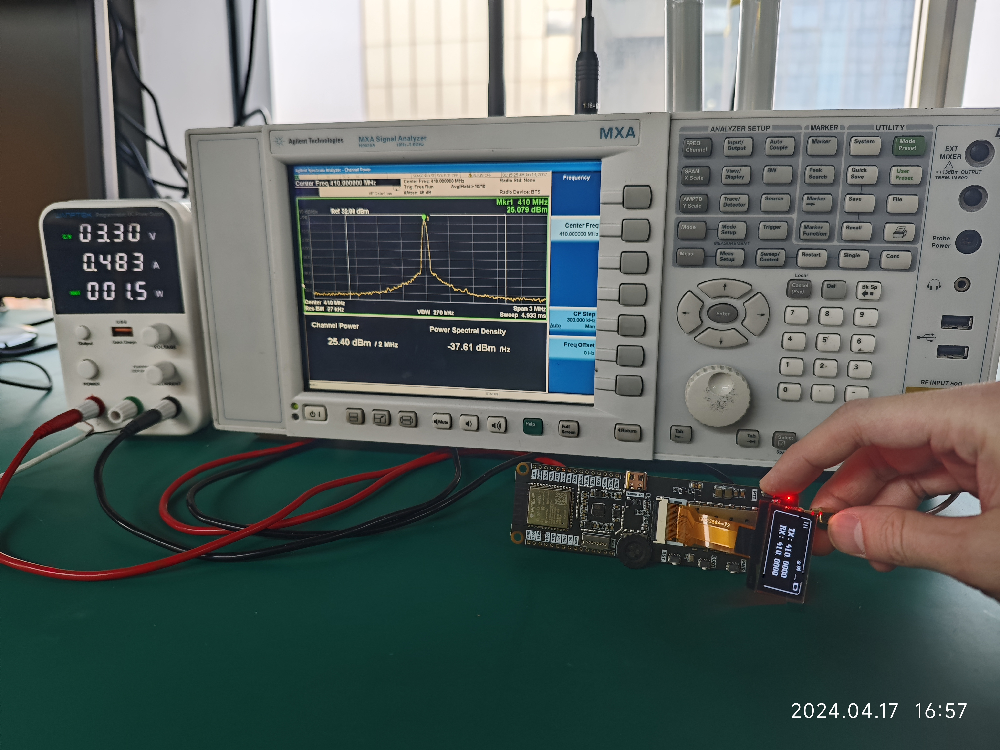
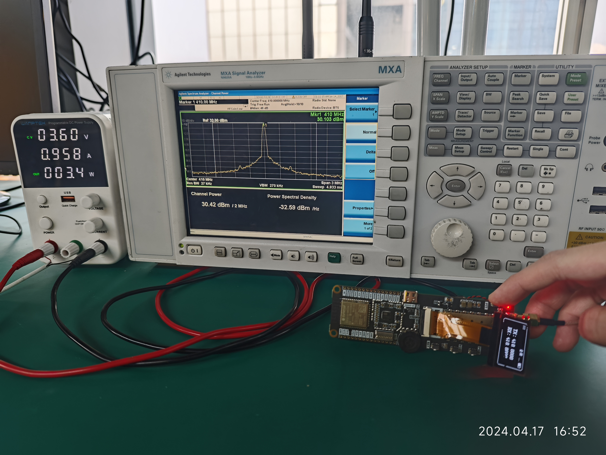

<h1 align = "center">🌟 LILYGO T-TWR 🌟</h1>


[](https://github.com/Xinyuan-LilyGO/T-TWR/actions/workflows/arduino_ci.yml)
[](https://github.com/Xinyuan-LilyGO/T-TWR/actions/workflows/pio.yml)


## News

#### There are the following differences between Rev2.1 and Rev2.0

1. Rev2.1 has a microphone switching matrix that can collect microphone signals for processing by ESP32S3, but Rev2.0 does not.
2. Rev2.1 has a speaker switching matrix, which can send audio signals to the power amplifier to play prompts, music, etc. through the switching matrix. Rev2.0 does not have it.
3. Rev2.1 has an IO switching matrix, and SA8X8 can be programmed through the switching matrix. Rev2.0 does not have this feature. This feature was proposed by the OpenRTX team. The function is not yet implemented. Please pay attention to OpenRTX for the latest progress.
4. Rev2.1 can determine whether the device address is UHF or VHF through OLED, but Rev2.0 cannot.
5. Rev2.1 can obtain whether the SA8X8 is currently in the receiving state by monitoring IO2, but Rev2.0 cannot..
6. In Rev2.1, the PTT button is changed to the left side, which is closer to the real walkie-talkie operating habits, while in Rev2.0, it is on the right side.
7. Rev2.1 changes the pixel light to the upper right to make it easier to monitor the status, Rev2.0 is on the side of the PCB
8. Rev2.1 reserves the RF front-end matching circuit, which makes it easier to fine-tune the signal.
9. The Rev2.1 RF module power supply is changed to direct battery power supply. Compared with the Rev2.0 DC power supply method, the power supply noise is minimized and can provide better RF performance.

## 1️⃣Support Product

| Product(PinMap)   | SOC        | Flash | PSRAM    |
| ----------------- | ---------- | ----- | -------- |
| [T-TWR Rev2.0][1] | ESP32-S3R8 | 16MB  | 8MB(OPI) |
| [T-TWR Rev2.1][2] | ESP32-S3R8 | 16MB  | 8MB(OPI) |

[1]: https://www.lilygo.cc/products/t-twr-plus
[2]: https://www.lilygo.cc/products/t-twr-rev2-1

## 2️⃣Examples

```txt
examples/
├── Factory                         # TWR Factory Application
├── GPS_Basic_Example               # GPS example
├── GPS_Full_Example                # GPS example
├── Pixels_RGBWstrandtest           # Pixels example
├── Pixels_Strandtest_Example       # Pixels example
├── SA868_ATDebug_Example           # Radio  AT Debug example
├── SA868_ESPSendAudio_Example      # Radio frequency sends ESP32 signal
├── SD_Test_Example                 # SD Test Example
├── SD_Time_Example                 # SD Time Example
├── WAV_Player                      # WAV Player
├── TFT_ArcFill_Example             # Screen extension example
├── TFT_Keypad_240x320_Example      # Screen extension example
├── U8g2_FontUsage_Example          # Onboard OLED U8G2 example
├── U8g2_GraphicsTest_Example       # Onboard OLED U8G2 example
└── U8g2_UpdateArea_Example         # Onboard OLED U8G2 example
```

## 3️⃣ PlatformIO Quick Start

1. Install [Visual Studio Code](https://code.visualstudio.com/) and [Python](https://www.python.org/)
2. Search for the `PlatformIO` plugin in the `VisualStudioCode` extension and install it.
3. After the installation is complete, you need to restart `VisualStudioCode`
4. After restarting `VisualStudioCode`, select `File` in the upper left corner of `VisualStudioCode` -> `Open Folder` -> select the `T-TWR` directory
5. Click on the `platformio.ini` file, and in the `platformio` column, cancel the sample line that needs to be used, please make sure that only one line is valid
6. Click the (✔) symbol in the lower left corner to compile
7. Connect the board to the computer USB
8. Click (→) to upload firmware
9. Click (plug symbol) to monitor serial output

## 4️⃣ Arduino IDE Quick Start

1. Install [Arduino IDE](https://www.arduino.cc/en/software)
2. Install [Arduino ESP32](https://docs.espressif.com/projects/arduino-esp32/en/latest/)
3. Copy all the folders in the `T-TWR/lib` directory to `<C:\Users\UserName\Documents\Arduino\libraries>`. If there is no `libraries` directory, please create a new one. Please note that you are not copying the `lib` directory, but copying the folders in the lib directory
4. Open ArduinoIDE -> `Tools`
    | Arduino IDE Setting                  | Value                             |
    | ------------------------------------ | --------------------------------- |
    | Board                                | **ESP32S3 Dev Module**            |
    | Port                                 | Your port                         |
    | USB CDC On Boot                      | Enable                            |
    | CPU Frequency                        | 240MHZ(WiFi)                      |
    | Core Debug Level                     | None                              |
    | USB DFU On Boot                      | Disable                           |
    | Erase All Flash Before Sketch Upload | Disable                           |
    | Events Run On                        | Core1                             |
    | Flash Mode                           | QIO 80MHZ                         |
    | Flash Size                           | **16MB(128Mb)**                   |
    | Arduino Runs On                      | Core1                             |
    | USB Firmware MSC On Boot             | Disable                           |
    | Partition Scheme                     | **16M Flash(3M APP/9.9MB FATFS)** |
    | PSRAM                                | **OPI PSRAM**                     |
    | Upload Mode                          | **UART0/Hardware CDC**            |
    | Upload Speed                         | 921600                            |
    | USB Mode                             | **CDC and JTAG**                  |
    * The options in bold are required, others are selected according to actual conditions.
5. Insert USB into the PC and click Upload <If the upload fails, View the FAQ below>

## 5️⃣ FAQ

1. ⚠⚠⚠ **Precautions (special matters)**:
    1. The **glue stick (RF) antenna** must be connected. If the antenna is not connected, the RF module may be damaged, and the PMU will automatically turn off the power output
    2. A separate USB power supply may not meet the power supply requirements, please connect the battery to use , **The Rev2.1 version must use a battery to power the radio frequency unit and cannot use USB to work alone (because the RF current is very large and the noise can be minimized using battery power)**
    3. Please note that when adjusting to high power transmission, please ensure that the battery has sufficient discharge capacity, otherwise the PMU will automatically shut down due to insufficient current.
    4. TWR Rev2.0 has two versions, one comes with NiceRF AT firmware, and the other is a community version without any functions. For the community version, please jump to [OpenRTX](https://github.com/OpenRTX/OpenRTX) to burn [OpenRTX SA8x8 firmware](https://github.com/OpenRTX/sa8x8-fw) for use. For novices, it is recommended to use NiceRF firmware.
    5. TWR Rev2.1 is version agnostic. The built-in NiceRF firmware can be flashed to OpenRTX firmware, but the NiceRF firmware cannot be restored after flashing.


2. Radio extremely hot when sending?
      1. If the power level is set to high, then the current consumption is huge and the efficiency is very low. It is not recommended to use high power because the difference between high and low power is very small, but the difference in current consumption is very large. You can check the comparison here

      | Voltage | Freq | High transmit power                    | Low transmit power                   |
      | ------- | ---- | -------------------------------------- | ------------------------------------ |
      | 3.3V    | UHF  |  |  |
      | 3.6V    | UHF  |  |  |
      | 4.2V    | UHF  |  |  |
      | 3.3V    | VHF  |  |  |
      | 3.6V    | VHF  |  |  |
      | 4.2V    | VHF  |   |  |


 3. ⚠ **Unable to download the program, the error is shown below.**
      <details>
      <summary>
      Click to view detailed steps
      </summary>

      ```shell
      Flash: [====      ]  35.7% (used 467813 bytes from 1310720 bytes)
      Configuring upload protocol...
      AVAILABLE: cmsis-dap, esp-bridge, esp-builtin, esp-prog, espota, esptool, iot-bus-jtag, jlink, minimodule, olimex-arm-usb-ocd, olimex-arm-usb-ocd-h, olimex-arm-usb-tiny-h, olimex-jtag-tiny, tumpa
      CURRENT: upload_protocol = esptool
      Looking for upload port...
      Auto-detected: COM236
      Uploading .pio\build\uhf_band\firmware.bin
      esptool.py v4.5
      Serial port COM236
      Connecting...

      A serial exception error occurred: ClearCommError failed (PermissionError(13, 'The device does not recognize the command.', None, 22))
      Note: This error originates from pySerial. It is likely not a problem with esptool, but with the hardware connection or drivers.
      For troubleshooting steps visit: https://docs.espressif.com/projects/esptool/en/latest/troubleshooting.html
      *** [upload] Error 1
      ================================================================================================================ [FAILED] Took 8.75 seconds ================================================================================================================

      ```
      - Step
      - Press the **PWR** button for one second to make sure the TWR is powered on
      - Press and hold the **BOOT** button (without releasing it), then press the **RST** button, then release the **RST** button, and finally release the **BOOT** button
      - Click the upload button in the IDE and wait for the upload to complete
      - Press the **RST** button to exit the download mode
      
      </details>

3. ⚠ **Can I change the voltage of the peripheral?**
      <details>
      <summary>
      Click to view detailed steps
      </summary>
        1. Not recommended, changing the peripheral voltage may cause abnormal operation, please do not change the default voltage setting of the peripheral, please refer to the voltage setting in the sample program.
      </details>

4. ⚠ **Why can't I test the charging current to reach the set current?**
      <details>
      <summary>
      Click to view detailed steps
      </summary>
       1. If you use a USBC cable with low quality or too large or too long wire resistance, there will be a large internal resistance, and there is no rated 5V input on the board, so the PMU will think that the power supply voltage is insufficient, so the rated charging current cannot be reached. ,The solution is to replace the high-quality USBC wire, reduce the length of the wire to meet the requirements of the PMU input voltage<br>
       2. You can measure the voltage at both ends of the figure below to see if it can meet the 5V input voltage required by the PMU<br>
         

      1. Please note that if the charging current is set to 1A, please install a suitable heat sink above the PMU to reduce the risk of heat and damage caused by overheating.
      </details>

5.  ⚠  When you think there is a problem with the board, you can try to burn our [factory firmware](./firmware/README.MD) for testing, you can first rule out whether it is a hardware problem

6. ⚠ **I don’t have a **21700 battery**, can I replace the battery holder with a **18650** battery holder?**
      <details>
      <summary>
      Click to view detailed steps
      </summary>
      1. The board is compatible with 21700 and 18650 battery holders, if you have the ability to replace it, please note that **LilyGo does not bear the risk of replacing the battery holder without authorization, damage and Brought to work abnormally**
      </details>

7. ⚠ **Can't turn on automatically after connecting the battery?**
      <details>
      <summary>
      Click to view detailed steps
      </summary>
      1. Connect the battery separately, you need to press the **PWR button** for one second, the board will start the action, press and hold the **PWR** button for 6 seconds to shut down, the shutdown time can be set by software , In the latest version (Rev2.1), inserting the battery will automatically power on.
      </details>

8. TWR currently has two modes before leaving the factory, one is flashed with regular firmware and uses the esp built-in boot, and the other uses TinyUF2 as the boot program. For novices, please [see here](./firmware/README.MD)

9.  How to enter TinyUF2 boot mode?

      <br>

      <details>
      <summary>
      Click to view detailed steps
      </summary>
       1. Before entering TinyUF2, the boot program must have been flashed. If it has not been written, please see here https://github.com/Xinyuan-LilyGO/T-TWR/blob/master/firmware/README.MD <br>
       2. Press the RST button<br>
       3. After pressing the RST button for one second, press the BOOT button. The disk will be ejected on the computer.<br>
       4. At this time, drag the firmware with the suffix uf2 into the disk to upgrade the device.<br>
      </details>
11. ⚠ **There is a microphone port on the bottom of the board, do I need to install a microphone? Only for Rev2.0, Rev2.1 has removed the external microphone interface**
      <details>
      <summary>
      Click to view detailed steps
      </summary>
      1. No, there is already a condenser microphone on board. If you need to use a wired microphone, please remove the board microphone. Please note that **LilyGo will not be responsible for the damage and abnormality of the board caused by unauthorized disassembly of the microphone**
      </details>


12. Sleep power consumption (**Rev2.1**), taking the Factory example as a reference, the deep sleep current is about **680uA**
      <br>


