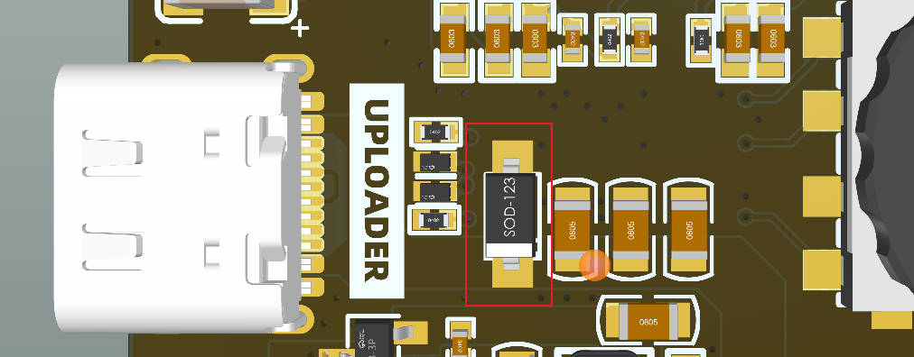

<h1 align = "center">✨ LILYGO T-TWR  ✨</h1>

## **[English](README.MD) | 中文**


- **TWR 1.x 版本** 请 [查看这里](https://t-twr.readthedocs.io/en/latest/)

------------


###  以下说明仅针对 **TWR Plus 2.0**

常见问题:

1. ⚠ **无法下载程序,错误如下面所示.**
   
    ```shell
    Flash: [====      ]  35.7% (used 467813 bytes from 1310720 bytes)
    Configuring upload protocol...
    AVAILABLE: cmsis-dap, esp-bridge, esp-builtin, esp-prog, espota, esptool, iot-bus-jtag, jlink, minimodule, olimex-arm-usb-ocd, olimex-arm-usb-ocd-h, olimex-arm-usb-tiny-h, olimex-jtag-tiny, tumpa
    CURRENT: upload_protocol = esptool
    Looking for upload port...
    Auto-detected: COM236
    Uploading .pio\build\uhf_band\firmware.bin
    esptool.py v4.5
    Serial port COM236
    Connecting...

    A serial exception error occurred: ClearCommError failed (PermissionError(13, 'The device does not recognize the command.', None, 22))
    Note: This error originates from pySerial. It is likely not a problem with esptool, but with the hardware connection or drivers.
    For troubleshooting steps visit: https://docs.espressif.com/projects/esptool/en/latest/troubleshooting.html
    *** [upload] Error 1
    ================================================================================================================ [FAILED] Took 8.75 seconds ================================================================================================================

    ```
    > 解决办法
     - 按住**BOOT**按键(不松开)，然后按下**RST**按键，再放开**RST**按键，最后放开**BOOT**按键
     - 然后按住**BOOT**按键(不松开)，然后按下**PWR**按键一秒，放开**PWR**按键，最后放开**BOOT**按键
     - 点击IDE中的上传图片,等待上传完毕
     - 按下**RST**按键，退出下载模式

2. ⚠ **我可以更改外设的电压吗 ？**

       1. 不推荐,更改外设电压可能导致工作异常,请不要更改外设的默认设置电压,请参照示例程序中的电压设定.
 
 3. ⚠**为什么我测试充电电流达不到所设定的电流?**
      1. 使用劣质或者线径电阻过大过长的USBC线会有较大的内阻，到达板子上已经没有额定的5V输入了,所以PMU会认为供电电压不足,所以达不到额定的充电电流,解决办法是更换优质的USBC线材，减量减少线的长度,以满足PMU输入电压的要求
      2. 可以测量下图两端的电压查看是否能够达到PMU要求的5V输入电压
         
     1. 请注意,如果设定充电电流为1A，请在PMU上方安装合适的散热器以减少热量和过热导致的损坏风险.

 4. ⚠ **当你认为板子有问题时,你可以尝试烧录我们的 [出厂固件](./firmware/twr-plus%202.0/README.MD) 进行测试,可以先排除是否是硬件问题**

 5. ⚠ 板子底部有个麦克风的接口，我需要安装麦克风吗 ？
     1. 不需要,板载已经有一个电容麦克风了，如果你需要使用连线麦克风，请移除板子麦克风，请注意,**LilyGo 不承担私自拆卸麦克风的导致板子的损坏和异常**

 6. ⚠ 我没有**21700电池**，我可以将电池座更换为 **18650**电池座吗？
     1. 板子兼容 **21700** 和 **18650** 型号的电池座,如果你有能力进行更换是可以的,请注意,**LilyGo 不承担私自更换电池座所带来的风险,损坏和带来的工作异常**

 7. ⚠ **接入电池后无法自动开机?**
     1. 单独接入电池，需要按下 **PWR按键** 一秒，板子才会进行开机的动作,长按**PWR**按键6秒将进行关机,关机时间可以通过软件设定


