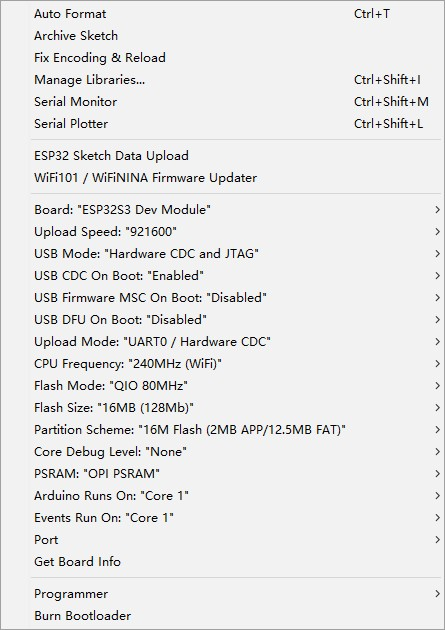

.. include:: ../links.ref
.. _at-debug:

*********
AT Debug
*********

Communication protocol for debugging SA868.

The esp32s3 is used as a serial port transponder, and the PC sends the SA868
command to the esp32s3 through the serial port tool,
and the esp32s3 forwards it to the SA868.

In the same way, the response command of SA868 is sent to esp32s3, and then forwarded to PC.

Arduino
========

The following configuration is recommended:

PlatformIO
===========

See |platformio-using|_.

Burning
========

The T-TWR is linked to the computer via USB. First press and hold **Volume-**,
then lightly press the reset button,
and finally release **Volume-** to enter the download mode.

Pinout
========

=============== ==== ===================================================================================================
Name            Pin  Note
--------------- ---- ---------------------------------------------------------------------------------------------------
SA868_TX_PIN    47   Serial transmit data pin
--------------- ---- ---------------------------------------------------------------------------------------------------
SA868_RX_PIN    48   Serial receive data pin
--------------- ---- ---------------------------------------------------------------------------------------------------
SA868_PTT_PIN   41   SA868 Transmitting/receiving control, "0" force the module to enter TX state; and "1" to Rx state.
--------------- ---- ---------------------------------------------------------------------------------------------------
SA868_PD_PIN    40   Power Down control, "0" for power down mode; "1" for the normal work
--------------- ---- ---------------------------------------------------------------------------------------------------
SA868_RF_PIN    39   high/low output power control; Leave open for high output power, low level to low output power.
--------------- ---- ---------------------------------------------------------------------------------------------------
BUTTON_PTT_PIN  38   transmit/receive button
=============== ==== ===================================================================================================

Datasheet
=========

* `ESP32-S3-WROOM-1-N16R8`_ (Datasheet)
* `SA868`_ (Datasheet)

.. _ESP32-S3-WROOM-1-N16R8: https://www.espressif.com.cn/sites/default/files/documentation/esp32-s3-wroom-1_wroom-1u_datasheet_cn.pdf
.. _SA868: ../../../../datasheet/SA868 2W Embedded walkie talkie moduleV1.2.pdf

Troubleshooting
================

If something goes wrong, first see :ref:`Troubleshooting <troubleshooting>`.
If :ref:`Troubleshooting <troubleshooting>` doesn't cover the issue you're having,
please get technical support via |github-issue|_.
