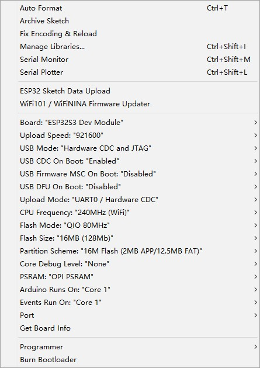

.. include:: ../links.ref
.. _walkie-talkie:

**************
Walkie Talkie
**************

Arduino
========

The following configuration is recommended:

PlatformIO
===========

See |platformio-using|_.

Install dependent libraries
============================

T-TWR supports the following versions of arduino-esp32:

    * |arduino-esp32|_

T-TWR needs the support of the following dependent libraries, users can use
the library management to install:

    * |RotaryEncoder|_
    * |OneButton|_
    * |U8g2_Arduino|_
    * |ArduinoJson|_

.. warning::

    If there is a compilation error, please check whether the above dependent
    library versions are consistent.

Band selection
===============

.. note::

    Because the AT command cannot read the frequency band information of the
    SA868 module, it is necessary to manually select the frequency band in
    the source code.

The ``UHF_BAND`` macro is used to select the UHF band, and the supported frequency range is 400 ~ 480 MHz

.. literalinclude:: ../../../examples/walkie_talkie/config.h
    :linenos:
    :language: c
    :lines: 6-6
    :lineno-start: 6

The ``_350_BAND`` macro is used to select the VHF band, the supported band range is 320 ~ 400 MHz

.. literalinclude:: ../../../examples/walkie_talkie/config.h
    :linenos:
    :language: c
    :lines: 11-11
    :lineno-start: 11

The ``VHF_BAND`` macro is used to select the VHF band, the supported band range is 134 ~ 174 MHz

.. literalinclude:: ../../../examples/walkie_talkie/config.h
    :linenos:
    :language: c
    :lines: 16-16
    :lineno-start: 16

.. include:: ../datasheet.inc

Burning
========

The T-TWR is linked to the computer via USB. First press and hold **Volume-**,
then lightly press the reset button,
and finally release **Volume-** to enter the download mode.

Detailed Operation
===================

pending upgrade.

Pinout
========

=============== ==== ===================================================================================================
Name            Pin  Note
--------------- ---- ---------------------------------------------------------------------------------------------------
SA868_TX_PIN    47   Serial transmit data pin
--------------- ---- ---------------------------------------------------------------------------------------------------
SA868_RX_PIN    48   Serial receive data pin
--------------- ---- ---------------------------------------------------------------------------------------------------
SA868_PTT_PIN   41   SA868 Transmitting/receiving control, "0" force the module to enter TX state; and "1" to Rx state.
--------------- ---- ---------------------------------------------------------------------------------------------------
SA868_PD_PIN    40   Power Down control, "0" for power down mode; "1" for the normal work
--------------- ---- ---------------------------------------------------------------------------------------------------
SA868_RF_PIN    39   high/low output power control; Leave open for high output power, low level to low output power.
--------------- ---- ---------------------------------------------------------------------------------------------------
BUTTON_PTT_PIN  38   transmit/receive button
--------------- ---- ---------------------------------------------------------------------------------------------------
BUTTON_UP_PIN   3    volume+
--------------- ---- ---------------------------------------------------------------------------------------------------
BUTTON_DOWN_PIN 0    volume-
--------------- ---- ---------------------------------------------------------------------------------------------------
ENCODER_A_PIN   9    Encoder Pin1
--------------- ---- ---------------------------------------------------------------------------------------------------
ENCODER_B_PIN   5    Encoder Pin2
--------------- ---- ---------------------------------------------------------------------------------------------------
ENCODER_OK_PIN  7    Encoder OK button
--------------- ---- ---------------------------------------------------------------------------------------------------
BATTERY_ADC_PIN 6    Battery voltage detection pin
--------------- ---- ---------------------------------------------------------------------------------------------------
OLED_POWER_PIN  21   OLED screen power control pin
--------------- ---- ---------------------------------------------------------------------------------------------------
LED_PIN         1    User-Defined Indicators
=============== ==== ===================================================================================================

Troubleshooting
================

If something goes wrong, first see :ref:`Troubleshooting <troubleshooting>`.
If :ref:`Troubleshooting <troubleshooting>` doesn't cover the issue you're having,
please get technical support via |github-issue|_.